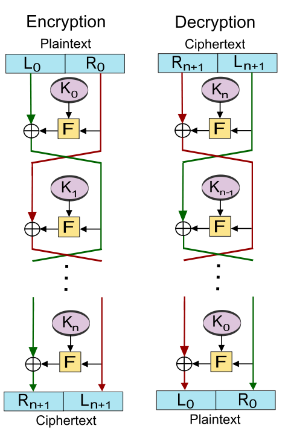

# 加密算法及Python库

参考：

[加密与解密_第4版](https://bbs.pediy.com/thread-230052.htm)

加密总共分三种，单项散列算法，对称加密算法，非对称加密算法。

## 单项散列算法

单向散列函数算法，也称为Hash算法，其特点为
>* 将任意长度的消息压缩到某一固定长度（消息摘要）
>* 过程不可逆

Hash 函数一般应用于：
>* 数字签名
>* 消息的完整性检测
>* 消息起源的认证检测

### MD5

##### 参考

[MD5穷举破解](https://www.cmd5.com/default.aspx)

[github_MD5实现](https://github.com/cofyc/r3/blob/master/src/core/u-md5.c)

##### 概述

对输入的任意长度的消息进行运算，产生一个128位的消息摘要。

##### 算法原理

**1. 数据填充**

填充消息，使得消息长度满足：


填充的方法是，填充 1个1和n个0。

**2. 添加长度**

在上一步结果中附件64位的消息长度，（448+64=512) 使得消息长度刚好是 512 的整数倍。恰好是 16*32 = 512, 代表16个 32位消息。

**3. 初始化变量**

对于A, B, C, D 4个32位寄存器，用4个16进制表示的数字来进行初始化:

``` C
#define INIT_DATA_A (unsigned long)0x67452301L
#define INIT_DATA_B (unsigned long)0xefcdab89L
#define INIT_DATA_C (unsigned long)0x98badcfeL
#define INIT_DATA_D (unsigned long)0x10325476L
```

**4. 数据处理**

以512位数据为一组来处理，首先定义4个辅助函数
``` C
#define	F(x,y,z)	((((y) ^ (z)) & (x)) ^ (z))
#define	G(x,y,z)	((((x) ^ (y)) & (z)) ^ (y))
#define	H(x,y,z)	((x) ^ (y) ^ (z))
#define	I(x,y,z)	(((x) | (~(z))) ^ (y))
```
对于每512位消息，对其中16个32位字，进行4轮运算。每一轮运算的操作如下：

将A,B,C,D 副本a,b,c,d 中的3个经过F,G,H,I运算后的结果与第4个相加，然后加上32位信息，和一个32位的加法常数，再左移若干位，最后加上a，b，c，d之一。

所有加法常数用表 T[I] 定义，I为1~64之中的随机值，T[I]等于 4294967296 （2^32）乘上 abs(sin(i)) 的整数部分。

算法即:

``` python
AA=A
BB=B
CC=C
DD=D
# 第一轮 [ABCD K S I] 表示操作 A=B+((A+F(B,C,D)+X[k]+T[i])<<S)，进行16次操作
[ABCD 0 7 1] [DABC 1 12 2] [CDAB 2 17 3] [BCDA 3 22 4]
...
# 第二轮 [ABCD K S I] 表示操作 A=B+((A+G(B,C,D)+X[k]+T[i])<<S)，进行16次操作
...
# 第三轮 [ABCD K S I] 表示操作 A=B+((A+H(B,C,D)+X[k]+T[i])<<S)，进行16次操作
...
# 第四轮 [ABCD K S I] 表示操作 A=B+((A+I(B,C,D)+X[k]+T[i])<<S)，进行16次操作
...
A=A+AA
B=B+BB
C=C+CC
D=D+DD
```
总之就是，4个数，4个操作，各种姿势来4次，对于每个32位信息，总共64次。

代码：
```C
#define R0(a,b,c,d,k,s,t) { \
	a+=((k)+(t)+F((b),(c),(d))); \
	a=ROTATE(a,s); \
	a+=b; };\

#define R1(a,b,c,d,k,s,t) { \
	a+=((k)+(t)+G((b),(c),(d))); \
	a=ROTATE(a,s); \
	a+=b; };

#define R2(a,b,c,d,k,s,t) { \
	a+=((k)+(t)+H((b),(c),(d))); \
	a=ROTATE(a,s); \
	a+=b; };

#define R3(a,b,c,d,k,s,t) { \
	a+=((k)+(t)+I((b),(c),(d))); \
	a=ROTATE(a,s); \
	a+=b; };
...
...
...
	A=c->A;
	B=c->B;
	C=c->C;
	D=c->D;

	/* Round 0 */
	R0(A,B,C,D,X[ 0], 7,0xd76aa478L);
	R0(D,A,B,C,X[ 1],12,0xe8c7b756L);
	R0(C,D,A,B,X[ 2],17,0x242070dbL);
	R0(B,C,D,A,X[ 3],22,0xc1bdceeeL);
	R0(A,B,C,D,X[ 4], 7,0xf57c0fafL);
	R0(D,A,B,C,X[ 5],12,0x4787c62aL);
	R0(C,D,A,B,X[ 6],17,0xa8304613L);
	R0(B,C,D,A,X[ 7],22,0xfd469501L);
	R0(A,B,C,D,X[ 8], 7,0x698098d8L);
	R0(D,A,B,C,X[ 9],12,0x8b44f7afL);
	R0(C,D,A,B,X[10],17,0xffff5bb1L);
	R0(B,C,D,A,X[11],22,0x895cd7beL);
	R0(A,B,C,D,X[12], 7,0x6b901122L);
	R0(D,A,B,C,X[13],12,0xfd987193L);
	R0(C,D,A,B,X[14],17,0xa679438eL);
	R0(B,C,D,A,X[15],22,0x49b40821L);
	/* Round 1 */
	R1(A,B,C,D,X[ 1], 5,0xf61e2562L);
	R1(D,A,B,C,X[ 6], 9,0xc040b340L);
	R1(C,D,A,B,X[11],14,0x265e5a51L);
	R1(B,C,D,A,X[ 0],20,0xe9b6c7aaL);
	R1(A,B,C,D,X[ 5], 5,0xd62f105dL);
	R1(D,A,B,C,X[10], 9,0x02441453L);
	R1(C,D,A,B,X[15],14,0xd8a1e681L);
	R1(B,C,D,A,X[ 4],20,0xe7d3fbc8L);
	R1(A,B,C,D,X[ 9], 5,0x21e1cde6L);
	R1(D,A,B,C,X[14], 9,0xc33707d6L);
	R1(C,D,A,B,X[ 3],14,0xf4d50d87L);
	R1(B,C,D,A,X[ 8],20,0x455a14edL);
	R1(A,B,C,D,X[13], 5,0xa9e3e905L);
	R1(D,A,B,C,X[ 2], 9,0xfcefa3f8L);
	R1(C,D,A,B,X[ 7],14,0x676f02d9L);
	R1(B,C,D,A,X[12],20,0x8d2a4c8aL);
	/* Round 2 */
	R2(A,B,C,D,X[ 5], 4,0xfffa3942L);
	R2(D,A,B,C,X[ 8],11,0x8771f681L);
	R2(C,D,A,B,X[11],16,0x6d9d6122L);
	R2(B,C,D,A,X[14],23,0xfde5380cL);
	R2(A,B,C,D,X[ 1], 4,0xa4beea44L);
	R2(D,A,B,C,X[ 4],11,0x4bdecfa9L);
	R2(C,D,A,B,X[ 7],16,0xf6bb4b60L);
	R2(B,C,D,A,X[10],23,0xbebfbc70L);
	R2(A,B,C,D,X[13], 4,0x289b7ec6L);
	R2(D,A,B,C,X[ 0],11,0xeaa127faL);
	R2(C,D,A,B,X[ 3],16,0xd4ef3085L);
	R2(B,C,D,A,X[ 6],23,0x04881d05L);
	R2(A,B,C,D,X[ 9], 4,0xd9d4d039L);
	R2(D,A,B,C,X[12],11,0xe6db99e5L);
	R2(C,D,A,B,X[15],16,0x1fa27cf8L);
	R2(B,C,D,A,X[ 2],23,0xc4ac5665L);
	/* Round 3 */
	R3(A,B,C,D,X[ 0], 6,0xf4292244L);
	R3(D,A,B,C,X[ 7],10,0x432aff97L);
	R3(C,D,A,B,X[14],15,0xab9423a7L);
	R3(B,C,D,A,X[ 5],21,0xfc93a039L);
	R3(A,B,C,D,X[12], 6,0x655b59c3L);
	R3(D,A,B,C,X[ 3],10,0x8f0ccc92L);
	R3(C,D,A,B,X[10],15,0xffeff47dL);
	R3(B,C,D,A,X[ 1],21,0x85845dd1L);
	R3(A,B,C,D,X[ 8], 6,0x6fa87e4fL);
	R3(D,A,B,C,X[15],10,0xfe2ce6e0L);
	R3(C,D,A,B,X[ 6],15,0xa3014314L);
	R3(B,C,D,A,X[13],21,0x4e0811a1L);
	R3(A,B,C,D,X[ 4], 6,0xf7537e82L);
	R3(D,A,B,C,X[11],10,0xbd3af235L);
	R3(C,D,A,B,X[ 2],15,0x2ad7d2bbL);
	R3(B,C,D,A,X[ 9],21,0xeb86d391L);

	c->A+=A&0xffffffffL;
	c->B+=B&0xffffffffL;
	c->C+=C&0xffffffffL;
	c->D+=D&0xffffffffL;
```

最后，A，B，C，D的级联就是 MD5 散列结果。

##### 特点

MD5 是一种超损压缩的算法，不可逆。

如果是采用MD5算法的软件，一定绕不开 A,B,C,D 4个常数，这是在汇编逐步破解时，非常明显的特征。

##### Python实现

```
import hashlib

# 待加密信息
str = 'i love you'

hl = hashlib.md5()
hl.update(str.encode(encoding='utf-8'))

print('MD5加密前为 ：' + str)
print('MD5加密后为 ：' + hl.hexdigest())
```
该加密信息能被[MD5穷举破解](https://www.cmd5.com/default.aspx)

### SHA

##### 参考

[github_SHA1算法实现](https://github.com/cofyc/r3/blob/master/src/core/u-sha1.c)

##### 概述

安全散列算法（Secure Hash Algorithm, SHA) 包括 SHA-1，SHA-256，SHA-384，SHA-512共4种分别产生160位，256位，384位，512位的散列值。

##### 算法原理

SHA-1 算法的消息分组和填充方式与MD5算法相同。

SHA-1 算法使用 f0~f79 的逻辑函数序列，对每一个 ft，输入3个32位信息B，C，D，输出一个32位信息。
``` C
#define F_00_19(b,c,d)	((((c) ^ (d)) & (b)) ^ (d))
#define F_20_39(b,c,d)	((b) ^ (c) ^ (d))
#define F_40_59(b,c,d)	(((b) & (c)) | (((b)|(c)) & (d)))
#define F_60_79(b,c,d)	F_20_39(b,c,d)
```

SHA-1 的常数表:
```C
#define K_00_19 0x5a827999L
#define K_20_39 0x6ed9eba1L
#define K_40_59 0x8f1bbcdcL
#define K_60_79 0xca62c1d6L
```

SHA-1 产生消息摘要，需要5个32位值做初始化。
```C
#define INIT_DATA_h0 (unsigned long)0x67452301L
#define INIT_DATA_h1 (unsigned long)0xefcdab89L
#define INIT_DATA_h2 (unsigned long)0x98badcfeL
#define INIT_DATA_h3 (unsigned long)0x10325476L
#define INIT_DATA_h4 (unsigned long)0xc3d2e1f0L
```

类似于MD5，它也有针对每轮的更新操作

代码：
```C
#define Xupdate(a,i,ia,ib,ic,id) (a)=\
	(ia[(i)&0x0f]^ib[((i)+2)&0x0f]^ic[((i)+8)&0x0f]^id[((i)+13)&0x0f]);\
	X[(i)&0x0f]=(a)=ROTATE((a),1);

#define BODY_00_15(i,a,b,c,d,e,f,xa) \
	(f)=xa[i]+(e)+K_00_19+ROTATE((a),5)+F_00_19((b),(c),(d)); \
	(b)=ROTATE((b),30);

#define BODY_16_19(i,a,b,c,d,e,f,xa,xb,xc,xd) \
	Xupdate(f,i,xa,xb,xc,xd); \
	(f)+=(e)+K_00_19+ROTATE((a),5)+F_00_19((b),(c),(d)); \
	(b)=ROTATE((b),30);

#define BODY_20_31(i,a,b,c,d,e,f,xa,xb,xc,xd) \
	Xupdate(f,i,xa,xb,xc,xd); \
	(f)+=(e)+K_20_39+ROTATE((a),5)+F_20_39((b),(c),(d)); \
	(b)=ROTATE((b),30);

#define BODY_32_39(i,a,b,c,d,e,f,xa) \
	Xupdate(f,i,xa,xa,xa,xa); \
	(f)+=(e)+K_20_39+ROTATE((a),5)+F_20_39((b),(c),(d)); \
	(b)=ROTATE((b),30);

#define BODY_40_59(i,a,b,c,d,e,f,xa) \
	Xupdate(f,i,xa,xa,xa,xa); \
	(f)+=(e)+K_40_59+ROTATE((a),5)+F_40_59((b),(c),(d)); \
	(b)=ROTATE((b),30);

#define BODY_60_79(i,a,b,c,d,e,f,xa) \
	Xupdate(f,i,xa,xa,xa,xa); \
	(f)=X[(i)&0x0f]+(e)+K_60_79+ROTATE((a),5)+F_60_79((b),(c),(d)); \
	(b)=ROTATE((b),30);
...
...
...
	A=c->h0;
	B=c->h1;
	C=c->h2;
	D=c->h3;
	E=c->h4;

	for (;;)
		{
	BODY_00_15( 0,A,B,C,D,E,T,W);
	BODY_00_15( 1,T,A,B,C,D,E,W);
	BODY_00_15( 2,E,T,A,B,C,D,W);
	BODY_00_15( 3,D,E,T,A,B,C,W);
	BODY_00_15( 4,C,D,E,T,A,B,W);
	BODY_00_15( 5,B,C,D,E,T,A,W);
	BODY_00_15( 6,A,B,C,D,E,T,W);
	BODY_00_15( 7,T,A,B,C,D,E,W);
	BODY_00_15( 8,E,T,A,B,C,D,W);
	BODY_00_15( 9,D,E,T,A,B,C,W);
	BODY_00_15(10,C,D,E,T,A,B,W);
	BODY_00_15(11,B,C,D,E,T,A,W);
	BODY_00_15(12,A,B,C,D,E,T,W);
	BODY_00_15(13,T,A,B,C,D,E,W);
	BODY_00_15(14,E,T,A,B,C,D,W);
	BODY_00_15(15,D,E,T,A,B,C,W);
	BODY_16_19(16,C,D,E,T,A,B,W,W,W,W);
	BODY_16_19(17,B,C,D,E,T,A,W,W,W,W);
	BODY_16_19(18,A,B,C,D,E,T,W,W,W,W);
	BODY_16_19(19,T,A,B,C,D,E,W,W,W,X);

	BODY_20_31(20,E,T,A,B,C,D,W,W,W,X);
	BODY_20_31(21,D,E,T,A,B,C,W,W,W,X);
	BODY_20_31(22,C,D,E,T,A,B,W,W,W,X);
	BODY_20_31(23,B,C,D,E,T,A,W,W,W,X);
	BODY_20_31(24,A,B,C,D,E,T,W,W,X,X);
	BODY_20_31(25,T,A,B,C,D,E,W,W,X,X);
	BODY_20_31(26,E,T,A,B,C,D,W,W,X,X);
	BODY_20_31(27,D,E,T,A,B,C,W,W,X,X);
	BODY_20_31(28,C,D,E,T,A,B,W,W,X,X);
	BODY_20_31(29,B,C,D,E,T,A,W,W,X,X);
	BODY_20_31(30,A,B,C,D,E,T,W,X,X,X);
	BODY_20_31(31,T,A,B,C,D,E,W,X,X,X);
	BODY_32_39(32,E,T,A,B,C,D,X);
	BODY_32_39(33,D,E,T,A,B,C,X);
	BODY_32_39(34,C,D,E,T,A,B,X);
	BODY_32_39(35,B,C,D,E,T,A,X);
	BODY_32_39(36,A,B,C,D,E,T,X);
	BODY_32_39(37,T,A,B,C,D,E,X);
	BODY_32_39(38,E,T,A,B,C,D,X);
	BODY_32_39(39,D,E,T,A,B,C,X);

	BODY_40_59(40,C,D,E,T,A,B,X);
	BODY_40_59(41,B,C,D,E,T,A,X);
	BODY_40_59(42,A,B,C,D,E,T,X);
	BODY_40_59(43,T,A,B,C,D,E,X);
	BODY_40_59(44,E,T,A,B,C,D,X);
	BODY_40_59(45,D,E,T,A,B,C,X);
	BODY_40_59(46,C,D,E,T,A,B,X);
	BODY_40_59(47,B,C,D,E,T,A,X);
	BODY_40_59(48,A,B,C,D,E,T,X);
	BODY_40_59(49,T,A,B,C,D,E,X);
	BODY_40_59(50,E,T,A,B,C,D,X);
	BODY_40_59(51,D,E,T,A,B,C,X);
	BODY_40_59(52,C,D,E,T,A,B,X);
	BODY_40_59(53,B,C,D,E,T,A,X);
	BODY_40_59(54,A,B,C,D,E,T,X);
	BODY_40_59(55,T,A,B,C,D,E,X);
	BODY_40_59(56,E,T,A,B,C,D,X);
	BODY_40_59(57,D,E,T,A,B,C,X);
	BODY_40_59(58,C,D,E,T,A,B,X);
	BODY_40_59(59,B,C,D,E,T,A,X);

	BODY_60_79(60,A,B,C,D,E,T,X);
	BODY_60_79(61,T,A,B,C,D,E,X);
	BODY_60_79(62,E,T,A,B,C,D,X);
	BODY_60_79(63,D,E,T,A,B,C,X);
	BODY_60_79(64,C,D,E,T,A,B,X);
	BODY_60_79(65,B,C,D,E,T,A,X);
	BODY_60_79(66,A,B,C,D,E,T,X);
	BODY_60_79(67,T,A,B,C,D,E,X);
	BODY_60_79(68,E,T,A,B,C,D,X);
	BODY_60_79(69,D,E,T,A,B,C,X);
	BODY_60_79(70,C,D,E,T,A,B,X);
	BODY_60_79(71,B,C,D,E,T,A,X);
	BODY_60_79(72,A,B,C,D,E,T,X);
	BODY_60_79(73,T,A,B,C,D,E,X);
	BODY_60_79(74,E,T,A,B,C,D,X);
	BODY_60_79(75,D,E,T,A,B,C,X);
	BODY_60_79(76,C,D,E,T,A,B,X);
	BODY_60_79(77,B,C,D,E,T,A,X);
	BODY_60_79(78,A,B,C,D,E,T,X);
	BODY_60_79(79,T,A,B,C,D,E,X);

	c->h0=(c->h0+E)&0xffffffffL;
	c->h1=(c->h1+T)&0xffffffffL;
	c->h2=(c->h2+A)&0xffffffffL;
	c->h3=(c->h3+B)&0xffffffffL;
	c->h4=(c->h4+C)&0xffffffffL;

	num-=64;
	if (num <= 0) break;

	A=c->h0;
	B=c->h1;
	C=c->h2;
	D=c->h3;
	E=c->h4;
```

最后，5个常数消息进行级联，就是结果。

##### 特点
其实SHA和MD5的算法和结构十分相似

区别在于 SHA-1比MD5多32位（多一个常数），因此安全性更高，也因此SHA-1的算法消耗更大。

##### Python实现
```
import hashlib

# 待加密信息
str = 'i love you'

hl = hashlib.sha1()
hl.update(str.encode(encoding='utf-8'))

print('sha1加密前为 ：' + str)
print('sha1加密后为 ：' + hl.hexdigest())
```
该加密信息同样能被[穷举破解](https://www.cmd5.com/default.aspx)

## 对称加密算法

对称加密算法的加密密钥和解密密钥是完全相同的，其安全性依赖于两个因素。
>* 加密算法足够强
>* 密钥足够安全

### RC4

##### 参考

[RC4_Wiki](https://zh.wikipedia.org/zh-hant/RC4)

[github_RC4](https://github.com/bozhu/RC4-Python/blob/master/rc4.py)

##### 概述
RC4会生成一种称为密钥流的伪随机流，与明文通过异或操作混合，从而达到加密的目的。

##### 背景

异或操作的对合性质.

```
a xor b = c
c xor b = a
```
其中b即密钥生成的伪随机流，a，c为明文，密文转换。

##### 算法原理


**1. KSA(the Key-Scheduling Algorithm)**

初始化长度为256的S盒。第一个for循环将0到255的互不重复的元素装入S盒。第二个for循环根据密钥打乱S盒。

```C
 for i from 0 to 255
     S[i] := i
 endfor
 j := 0
 for( i=0 ; i<256 ; i++)
     j := (j + S[i] + key[i mod keylength]) % 256 //使用密钥
     swap values of S[i] and S[j]                 //交换S[i]，S[j]
 endfor
```

密钥的长度一般取5~16字节，通常不超过32字节（即256位）。

**2. PRGA(the Pseudo-Random Generation Algorithm)**

数组S完成初始化后，就不需要密钥了。这里的密钥流生成算法，是通过一定算法，定位出S盒中的一个元素，并与明文输入字节异或，得到密文。

```
 i := 0
 j := 0
 while GeneratingOutput:
     i := (i + 1) mod 256   //a
     j := (j + S[i]) mod 256 //b
     swap values of S[i] and S[j]  //c
     k := inputByte ^ S[(S[i] + S[j]) % 256]
     output K
 endwhile
```

（a，b）的目的是定位S盒中的元素，并在步骤 c 中，修改了S盒。

##### 特点
RC4算法简单易懂，也非常容易实现，效率也很高。

不过RC4的密钥必须保证足够"新鲜"，在大量数据包的攻击下，很可能出现重复的子密钥，导致破解。

##### Python实现
```Python
#!/usr/bin/env python

def KSA(key):
	keylength = len(key)

	S = {}

	for i in range(256):
		S[i] = i

	j = 0
	for i in range(256):
		j = (j + S[i] + key[i % keylength]) % 256
		S[i], S[j] = S[j], S[i]  # swap

	return S


def PRGA(S):
	i = 0
	j = 0
	while True:
		i = (i + 1) % 256
		j = (j + S[i]) % 256
		S[i], S[j] = S[j], S[i]  # swap

		K = S[(S[i] + S[j]) % 256]
		yield K


def RC4(key):
	S = KSA(key)
	return PRGA(S)


if __name__ == '__main__':
	# test vectors are from http://en.wikipedia.org/wiki/RC4

	# ciphertext should be BBF316E8D940AF0AD3
	key = 'Key'
	plaintext = 'Plaintext'

	# ciphertext should be 1021BF0420
	#key = 'Wiki'
	#plaintext = 'pedia'

	# ciphertext should be 45A01F645FC35B383552544B9BF5
	#key = 'Secret'
	#plaintext = 'Attack at dawn'

	def convert_key(s):
		return [ord(c) for c in s]
	key = convert_key(key)

	keystream = RC4(key)

	print(plaintext)

	encodeStream = []
	#encode
	import sys
	for c in plaintext:
		encodeC = ord(c) ^ next(keystream)
		sys.stdout.write(("%02X" % encodeC))
		encodeStream.append(encodeC)
	print()

	#decode
	keystream2 = RC4(key)
	for c in encodeStream:
		decodeC = c ^ next(keystream2)
		sys.stdout.write(str(chr(decodeC)))
	print()
```

### TEA

##### 参考

[TEA_Wiki](https://zh.wikipedia.org/wiki/%E5%BE%AE%E5%9E%8B%E5%8A%A0%E5%AF%86%E7%AE%97%E6%B3%95)

[Feistel](https://zh.wikipedia.org/wiki/%E8%B4%B9%E6%96%AF%E5%A6%A5%E5%AF%86%E7%A0%81)

##### 概述
TEA是采用轮加密网络，对信息进行异或操作加密的一种算法。

##### 背景
该对称算法基于一个对称的密码结构，**Feistel cipher** 费斯妥密码。

其核心的加密还是 XOR 操作，但因为有轮巡的机制，所以能保证正向操作和逆向操作中，对函数F的输入一致

这样保证了对合性，而且最重要的是，这种方法不要求函数 F 是对合的。



##### 算法原理

TEA的分组长度为64位，密钥长度为128位，总共进行32次循环加密，即64轮。

其中K[0]~K[3] 为密钥，v[0],v[1]为明文拆分的等长块。

在1998年发布的版本上，long代表32位的长度。

```C
#include <stdint.h>

void encrypt (uint32_t* v, uint32_t* k) {
    uint32_t v0=v[0], v1=v[1], sum=0, i;           /* set up */
    uint32_t delta=0x9e3779b9;                     /* a key schedule constant */
    uint32_t k0=k[0], k1=k[1], k2=k[2], k3=k[3];   /* cache key */
    for (i=0; i < 32; i++) {                       /* basic cycle start */
        sum += delta;
        v0 += ((v1<<4) + k0) ^ (v1 + sum) ^ ((v1>>5) + k1);
        v1 += ((v0<<4) + k2) ^ (v0 + sum) ^ ((v0>>5) + k3);  
    }                                              /* end cycle */
    v[0]=v0; v[1]=v1;
}

void decrypt (uint32_t* v, uint32_t* k) {
    uint32_t v0=v[0], v1=v[1], sum=0xC6EF3720, i;  /* set up */
    uint32_t delta=0x9e3779b9;                     /* a key schedule constant */
    uint32_t k0=k[0], k1=k[1], k2=k[2], k3=k[3];   /* cache key */
    for (i=0; i<32; i++) {                         /* basic cycle start */
        v1 -= ((v0<<4) + k2) ^ (v0 + sum) ^ ((v0>>5) + k3);
        v0 -= ((v1<<4) + k0) ^ (v1 + sum) ^ ((v1>>5) + k1);
        sum -= delta;                                   
    }                                              /* end cycle */
    v[0]=v0; v[1]=v1;
}
```


##### 特点

TEA的算法加密解密都很简单，但有相当大的缺陷，后续也提出了一些改进的算法，比如 XTEA

##### Python实现

TEA的实现一般来说直接用代码实现即可，不需要用到库

```python
#!/usr/bin/env python
#-*- coding: utf-8 -*-

import sys
from ctypes import *

def encipher(v, k):
    y = c_uint32(v[0])
    z = c_uint32(v[1])
    sum = c_uint32(0)
    delta = 0x9e3779b9
    n = 32
    w = [0,0]

    while(n>0):
        sum.value += delta
        y.value += ( z.value << 4 ) + k[0] ^ z.value + sum.value ^ ( z.value >> 5 ) + k[1]
        z.value += ( y.value << 4 ) + k[2] ^ y.value + sum.value ^ ( y.value >> 5 ) + k[3]
        n -= 1

    w[0] = y.value
    w[1] = z.value
    return w

def decipher(v, k):
    y = c_uint32(v[0])
    z = c_uint32(v[1])
    sum = c_uint32(0xc6ef3720)
    delta = 0x9e3779b9
    n = 32
    w = [0,0]

    while(n>0):
        z.value -= ( y.value << 4 ) + k[2] ^ y.value + sum.value ^ ( y.value >> 5 ) + k[3]
        y.value -= ( z.value << 4 ) + k[0] ^ z.value + sum.value ^ ( z.value >> 5 ) + k[1]
        sum.value -= delta
        n -= 1

    w[0] = y.value
    w[1] = z.value
    return w

if __name__ == "__main__":
    key = [1,2,3,4]
    v = [1385482522,639876499]
    enc = encipher(v,key)
    print (enc)
    print (decipher(enc,key))
```

### IDEA

##### 参考
[模反元素_Wiki](https://zh.wikipedia.org/wiki/%E6%A8%A1%E5%8F%8D%E5%85%83%E7%B4%A0)

[常见逆元算法](https://blog.csdn.net/acdreamers/article/details/8220787)

[github_逆元代码](https://github.com/davidmigloz/IDEA-cipher/blob/master/src/main/java/com/davidmiguel/idea_cipher/crypto/IdeaCipher.java#L138)

##### 概述

IDEA加密方法也是使用轮加密的机制，其特点是在3种不同代数群上的操作。

##### 背景

1. xor

2. 模加法运算
``` java
    /**
     * Addition in the additive group (mod 2^16).
     * Range [0, 0xFFFF].
     */
    private static int add(int x, int y) {
        return (x + y) & 0xFFFF;
    }

    /**
     * Additive inverse in the additive group (mod 2^16).
     * Range [0, 0xFFFF].
     */
    private static int addInv(int x) {
        return (0x10000 - x) & 0xFFFF;
    }
```
模加法的逆元如下
```python
x + addinv(x) = 0(mod 65536)
```

即x是加密因子，addinv(x)是解密因子，他们可以使得
```
(Msg + Key) % Mod = Cipher
(Cipher + InvKey) % Mod = Msg
```

3. 模乘法运算

模乘法的逆元如下
``` python
x * mulinv(x) = 1(mod 65537)
```

即x是加密因子，mulinv(x)是解密因子，他们可以使得
```
(Msg * Key) % Mod = Cipher
(Cipher * InvKey) % Mod = Msg
```

[模逆元](https://zh.wikipedia.org/wiki/%E6%A8%A1%E5%8F%8D%E5%85%83%E7%B4%A0)

求模逆的算法常见有费马小定理，拓展欧几里得算法等，在这里不一一拓展。

下面是代码
```java
    /**
     * Multiplication in the multiplicative group (mod 2^16+1 = mod 0x10001).
     * Range [0, 0xFFFF].
     */
    private static int mul(int x, int y) {
        long m = (long) x * y;
        if (m != 0) {
            return (int) (m % 0x10001) & 0xFFFF;
        } else {
            if (x != 0 || y != 0) {
                return (1 - x - y) & 0xFFFF;
            }
            return 1;
        }
    }

    /**
     * Multiplicative inverse in the multiplicative group (mod 2^16+1 = mod 0x10001).
     * It uses Extended Euclidean algorithm to compute the inverse.
     * For the purposes of IDEA, the all-zero sub-block is considered to represent 2^16 = −1
     * for multiplication modulo 216 + 1; thus the multiplicative inverse of 0 is 0.
     * Range [0, 0xFFFF].
     */
    @SuppressWarnings("SuspiciousNameCombination")
    private static int mulInv(int x) {
        if (x <= 1) {
            // 0 and 1 are their own inverses
            return x;
        }
        try {
            int y = 0x10001;
            int t0 = 1;
            int t1 = 0;
            while (true) {
                t1 += y / x * t0;
                y %= x;
                if (y == 1) {
                    return (1 - t1) & 0xffff;
                }
                t0 += x / y * t1;
                x %= y;
                if (x == 1) {
                    return t0;
                }
            }
        } catch (ArithmeticException e) {
            return 0;
        }
    }
}
```

##### 算法原理

分组密码明文和密文长度为64位，分为 4 份，每份16位。密钥长度为128位。

**步骤1**


由128位密钥生成52个16位子秘钥，生成方式为前8个16位直接作为密钥，循环左移5位，再取前8个。

**步骤2**


其轮次由8个相同的加密步骤（称为加密轮）和1个输出轮变换组成。

其中

```
Bitwise XOR (exclusive OR) (denoted with a blue circled plus ⊕).
Addition modulo 216 (denoted with a green boxed plus ⊞).
Multiplication modulo 216 + 1, where the all-zero word (0x0000) in inputs is interpreted as 216, and 216 in output is interpreted as the all-zero word (0x0000) 
(denoted by a red circled dot ⊙).
```

### BlowFish

##### 参考

[BlowFish_Wiki](https://en.wikipedia.org/wiki/Blowfish_(cipher))

[BlowFish_Github](https://github.com/h2so5/Blowfish/blob/master/blowfish.cpp)

##### 概述

该算法也是基于Feistel网络的加密算法，但对该算法更加关键的在于子密钥和SBox的生成。

##### 算法原理

1. 子密钥生成

BlowFish 使用大量的子密钥。这些密钥必须在加密前通过预计算产生。

它需要18个32位的子密钥: P[1],P[2],...P[18]
```C
const uint32_t initial_pary[18] = {
    0x243f6a88, 0x85a308d3, 0x13198a2e, 0x03707344, 0xa4093822, 0x299f31d0,
    0x082efa98, 0xec4e6c89, 0x452821e6, 0x38d01377, 0xbe5466cf, 0x34e90c6c,
    0xc0ac29b7, 0xc97c50dd, 0x3f84d5b5, 0xb5470917, 0x9216d5d9, 0x8979fb1b};
```
以及4个8x32，包含1024个32位字的S-box:
```
S(1,0) , S(1,1) , ... S(1,255)
S(2,0) , S(2,1) , ... S(2,255)
S(3,0) , S(3,1) , ... S(3,255)
S(4,0) , S(4,1) , ... S(4,255)
```
这里的256对应8位索引

初始化的步骤如下
>* 用常数π的小部分初始化 SBox, P数组
>* P数组和密钥进行逐位异或，如果密钥长度不够，循环重用密钥
>* 对一条全0的64位信息，使用 BlowFish 加密算方法加密，用输出替代 P[1]，P[2]
>* 用当前的P和S对 上一步的输出进行加密，并用输出分别代替 P[3]，P[4]
>* 重复上面2步，直到所有P数组和SBox的元素被替换为止

2. 加密


64位的明文分为2份32位，分别使用 P[1]~P[18] 密钥加密，进行异或操作，生成 4个SBox的索引，取出值进行运算。

```C
F(a,b,c,d) = ((sbox_[0][a] + sbox_[1][b]) ^ sbox_[2][c]) + sbox_[3][d]
```

3.解密
解密方法与加密方法完全相同，将 P[1]~P[18] 反过来使用即可。

##### 特点

blowfish的安全性取决于密钥的长度，其长度可以从32位到448位（最初的P数组异或操作）

目前来说，该算法的强度非常高。

##### Python实现

blowfish
```
pip install blowfish
```

```python
import blowfish

# 密钥
cipher = blowfish.Cipher(b"Key must be between 4 and 56 bytes long.")

from os import urandom

# 明文
block = "this 123".encode("utf-8")
print(block)

ciphertext = cipher.encrypt_block(block)
plaintext = cipher.decrypt_block(ciphertext)

# 解密明文
print(plaintext)
assert block == plaintext

```

## 公开密钥加密算法

在对称加密算法中，加密和解密使用的是同一份密钥。则当密钥泄露时，保护就失效了。

于是提出了公开密钥的算法，任何人都可以使用公钥进行加密，但只有有私钥的人才能进行解密。

这里引用阮老师对非对称加密的2种最常见的用法，加密验证和数字签名的说明。

[数字证书是什么](http://www.ruanyifeng.com/blog/2011/08/what_is_a_digital_signature.html)

### RSA

##### 参考
[阮老师的RSA算法](http://www.ruanyifeng.com/blog/2013/06/rsa_algorithm_part_one.html)

##### 概述
RSA既能用于数据加密，也能用于数字签名，其安全性依赖于大整数的因式分解，对于现在的技术来说，2048位的模长足够保证安全。

##### 背景

1. 欧拉函数


2. [模逆元](https://zh.wikipedia.org/wiki/%E6%A8%A1%E5%8F%8D%E5%85%83%E7%B4%A0)

##### 算法原理

利用到的，还是模逆元的概念。

2^16+1 65537 是一个质素。

| 内容             | 说明     |
| --------         | -----   | 
| n                | 2个素数 pq 的积         |
| 公钥(n,e)        | e 与(p-1)(q-1)互素      | 
| 私钥(n,d)        | ed == 1 mod ((p-1)(q-1)) ed互为(p-1)(q-1)的模拟  |
| 加密             | c = m^e mod n      |
| 解密             | m = c^d mod n      |

##### 特点
对模元素n有一定的长度要求，为了防止被因式分解而破解。

公钥e，选取的素数一般会是，3 ，17，65537等。

##### Python实现
使用rsa库
```
import rsa

if __name__ == '__main__':
	(pubkey, privkey) = rsa.newkeys(1024, poolsize=8)

	msg = b"Hello Test"

	crypto = rsa.encrypt(msg, pubkey)
	uncry = rsa.decrypt(crypto, privkey)

	print(uncry)

```

### ELGamal

##### 参考

[ELGamal_Wiki](https://zh.wikipedia.org/wiki/%E8%BF%AA%E8%8F%B2-%E8%B5%AB%E7%88%BE%E6%9B%BC%E5%AF%86%E9%91%B0%E4%BA%A4%E6%8F%9B)

[迪菲-赫尔曼密钥交换](https://zh.wikipedia.org/wiki/%E8%BF%AA%E8%8F%B2-%E8%B5%AB%E7%88%BE%E6%9B%BC%E5%AF%86%E9%91%B0%E4%BA%A4%E6%8F%9B)

##### 概述

既可以用作签名，也可以用作加密的算法，其安全性依赖于在有限域上计算离散对数的安全性（我也不知道是啥）

##### 背景

该算法的背景是**迪菲-赫尔曼密钥交换**


```
爱丽丝和鲍伯最终都得到了同样的值
因为在模p下 g^{ab} 和 g^{ba} 相等。
注意a, b 和 g^ab = g^ba mod p 是秘密的。
其他所有的值 p, g, g^a mod p, 以及 g^b mod p  都可以在公共信道上传递。
一旦爱丽丝和鲍伯得出了公共秘密，他们就可以把它用作对称密钥，以进行双方的加密通讯
因为这个密钥只有他们才能得到。
```

##### 算法原理

**密钥生成**

选择一个大素数P，选取一个大数x，选定一个生成元g，计算

```
y = (g^x) mod p
```
其中 y，g，p是公钥，x是私钥。

**加密**

随机选取随机数k，且k和p-1互质
```
a = (g^k) mod p
b = (y^k) M mod p
```
其中(a，b)为密文，密文是明文的2倍长
k 必须丢弃

**解密**

```
M = b / (a^x) mod p
```

##### 特点
1. p 这个素数要足够大，因为生成的 k 在[1~p-1] 中

2. a,b同样要求足够大，而生成元g，一般是 2 或者 5

3. 因为每次一次通信生成的 a，b都可能不一致，所以密钥k会自行更新。

## 涉及到的Python库

>* 算法库其实相对较多，有集成的算法库 cryptography，crypto 等，也有单独的算法库，如rsa库
>* 其函数的调用流程大同小异，无非是一个：


在这里，整理了一份表格(针对Python 3.6)

| 库 | 说明 | 特点 |
|-|-|-|
| hashlib | 自带库 | 支持散列和消息摘要的常见算法，如MD5，SHA-1等 |
| blowfish | blowfish算法库 | |
| rsa | rsa算法库 | 支持加密和验证2种流程 |
| cryptography | 成型的密码学算法库 | 支持通用加密算法的高级接口 |

计划：

对称加密，作为轮加密和字符运算比较简单，完全可以自行使用 Python 实现，并且可以修改一些初始化值和加密函数来做到变种。

非对称加密，看需求进行添加，目前而言，使用RSA算法加密即可。


